``` r
library(dplyr)
```

    ## 
    ## Attaching package: 'dplyr'

    ## The following objects are masked from 'package:stats':
    ## 
    ##     filter, lag

    ## The following objects are masked from 'package:base':
    ## 
    ##     intersect, setdiff, setequal, union

``` r
mkt_seg = read.csv("/Users/CatherineMiao/Desktop/STA380-master/data/social_marketing.csv") %>% as.tbl
```

Method 1: K-means clustering
============================

Exploting Correlations between features
=======================================

``` r
#install.packages("corrplot")
library(corrplot)
```

    ## corrplot 0.84 loaded

``` r
#str(mkt_seg)
cormp <- cor(mkt_seg[c(2:37)])

cex.before <- par("cex")
par(cex = 0.7)
corrplot(cormp, method ='shade',tl.cex = 0.65)
```

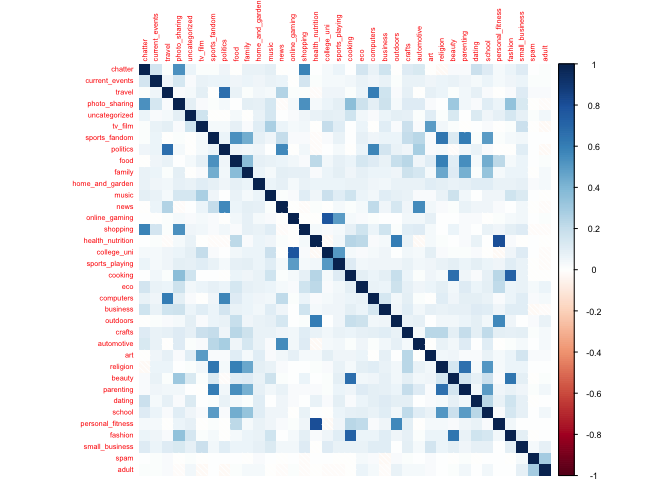

``` r
#par(cex = cex.before)

# strong corelation between personal fitness and health_nutrition 
# online gaming vs college_uni - 0.77
# travel vs politics - 0.66 
# beauty vs cooking - 0.66 
cor(mkt_seg$politics, mkt_seg$travel) # 0.66 
```

    ## [1] 0.66021

``` r
cor(mkt_seg$online_gaming, mkt_seg$college_uni) # 0.77
```

    ## [1] 0.7728393

``` r
cor(mkt_seg$personal_fitness,mkt_seg$health_nutrition) #0.81
```

    ## [1] 0.8099024

``` r
cor(mkt_seg$religion, mkt_seg$sports_fandom)
```

    ## [1] 0.6379748

``` r
#cormp
#as.data.frame(apply(cormp, 2, function(x) ifelse (abs(x)>=0.6,x,"NA")))
```

``` r
#summary(mkt_seg)
#names(mkt_seg)
raw_features = mkt_seg[-1]
features = scale(raw_features,center = T, scale = T)

mu = attr(features,"scaled:center")
sigma = attr(features,"scaled:scale")

#nrow(mkt_seg) #7882
#nrow(na.omit(mkt_seg))
set.seed(66)
kmeans=kmeans(features, 5)
length(which(kmeans$cluster == 1)) 
```

    ## [1] 1786

``` r
length(which(kmeans$cluster == 2)) 
```

    ## [1] 706

``` r
length(which(kmeans$cluster == 3)) 
```

    ## [1] 762

``` r
length(which(kmeans$cluster == 4)) 
```

    ## [1] 4579

``` r
length(which(kmeans$cluster == 5)) 
```

    ## [1] 49

Finding Number of Clusters
==========================

``` r
library(foreach)
library(dplyr)
library(tidyverse)
```

    ## ── Attaching packages ─────────────────────────────────────── tidyverse 1.2.1 ──

    ## ✔ ggplot2 3.2.0     ✔ readr   1.3.1
    ## ✔ tibble  2.0.1     ✔ purrr   0.3.0
    ## ✔ tidyr   0.8.2     ✔ stringr 1.3.1
    ## ✔ ggplot2 3.2.0     ✔ forcats 0.3.0

    ## ── Conflicts ────────────────────────────────────────── tidyverse_conflicts() ──
    ## ✖ purrr::accumulate() masks foreach::accumulate()
    ## ✖ dplyr::filter()     masks stats::filter()
    ## ✖ dplyr::lag()        masks stats::lag()
    ## ✖ purrr::when()       masks foreach::when()

``` r
set.seed(2)
mkt_seg = read.csv("/Users/CatherineMiao/Desktop/STA380-master/data/social_marketing.csv") %>% as.tbl
mkt_seg=na.omit(mkt_seg)
raw_features = mkt_seg[-1]
features = scale(raw_features,center = T, scale = T)
k_grid = seq(1,50, by=1)
SSE_grid = foreach(k=k_grid, .combine = "c") %do% {
   cluster_k = kmeans(features,k,nstart=5) 
   cluster_k$tot.withinss
 }
```

    ## Warning: did not converge in 10 iterations

    ## Warning: did not converge in 10 iterations

    ## Warning: did not converge in 10 iterations

    ## Warning: did not converge in 10 iterations

    ## Warning: did not converge in 10 iterations

    ## Warning: did not converge in 10 iterations

    ## Warning: did not converge in 10 iterations

    ## Warning: did not converge in 10 iterations

    ## Warning: did not converge in 10 iterations

    ## Warning: did not converge in 10 iterations

    ## Warning: did not converge in 10 iterations

    ## Warning: did not converge in 10 iterations

    ## Warning: did not converge in 10 iterations

``` r
plot(k_grid, SSE_grid, xlim=c(0,20))
```

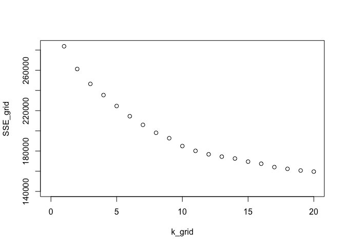 \# CH Index - measure goodness of fit \# Find the K that maximize CH\_grid

``` r
N=nrow(mkt_seg)
CH_grid = foreach(k=k_grid, .combine = "c") %do% {
   W = cluster_k$tot.withinss
   B = cluster_k$betweenss
   CH = (B/W)*((N-k)/(k-1))
   CH
 }
plot(k_grid, CH_grid)
```

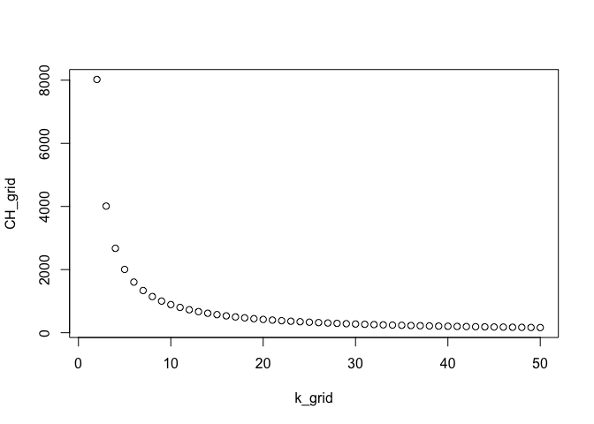 From the within cluster sum-of-square plot and the CH index plot, we determine that the optimal number of clusters is between 2 and 15. We would like to use 5 as our number of clusters. \# K-means clustering

``` r
set.seed(8)
plot(mkt_seg[c("outdoors","computers")],col=kmeans$cluster)
```

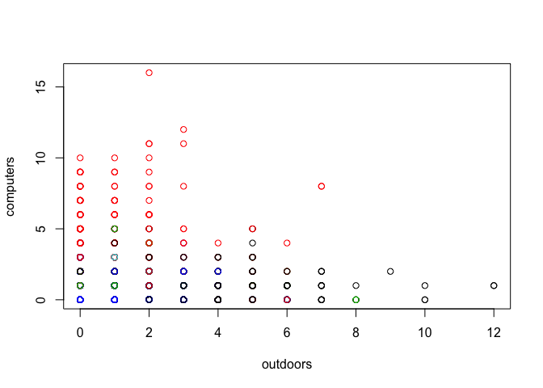

``` r
names(mkt_seg)
```

    ##  [1] "X"                "chatter"          "current_events"  
    ##  [4] "travel"           "photo_sharing"    "uncategorized"   
    ##  [7] "tv_film"          "sports_fandom"    "politics"        
    ## [10] "food"             "family"           "home_and_garden" 
    ## [13] "music"            "news"             "online_gaming"   
    ## [16] "shopping"         "health_nutrition" "college_uni"     
    ## [19] "sports_playing"   "cooking"          "eco"             
    ## [22] "computers"        "business"         "outdoors"        
    ## [25] "crafts"           "automotive"       "art"             
    ## [28] "religion"         "beauty"           "parenting"       
    ## [31] "dating"           "school"           "personal_fitness"
    ## [34] "fashion"          "small_business"   "spam"            
    ## [37] "adult"

``` r
qplot(food, cooking, data=mkt_seg, color=factor(kmeans$cluster))
```

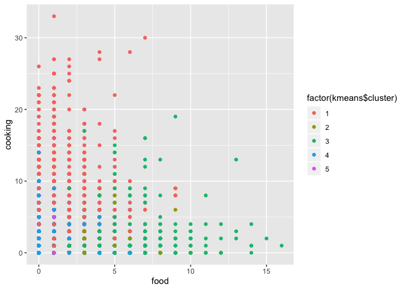

``` r
qplot(mkt_seg$online_gaming,mkt_seg$college_uni,color=factor(kmeans$cluster))
```

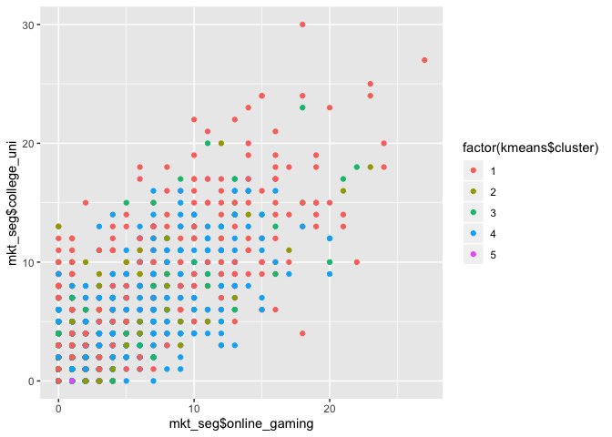

``` r
qplot(mkt_seg$art,mkt_seg$music,color=factor(kmeans$cluster))
```

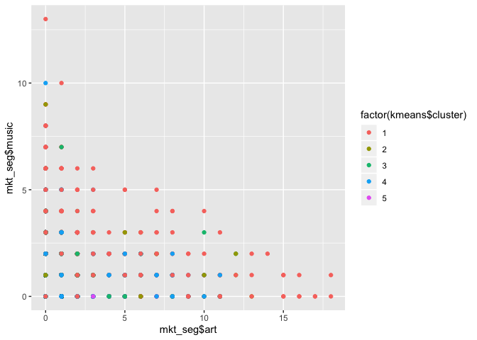

``` r
qplot(mkt_seg$small_business,mkt_seg$art,color=factor(kmeans$cluster))
```

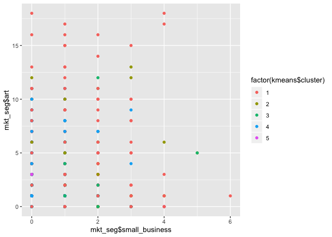

``` r
qplot(mkt_seg$personal_fitness,mkt_seg$health_nutrition,color=factor(kmeans$cluster)) 
```

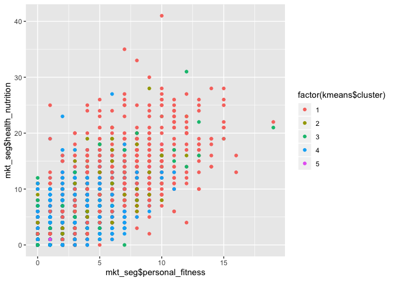

``` r
qplot(mkt_seg$politics,mkt_seg$travel,color=factor(kmeans$cluster))
```

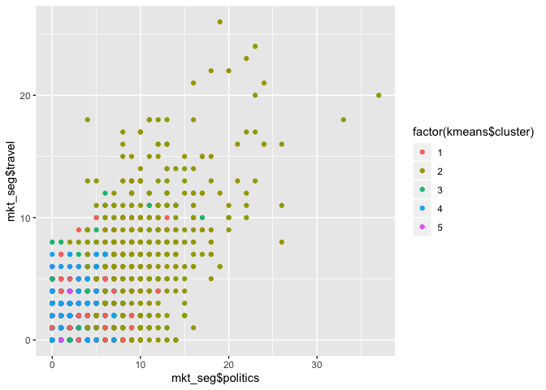

``` r
qplot(mkt_seg$politics,mkt_seg$current_events,color=factor(kmeans$cluster))
```

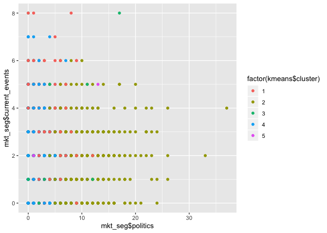

``` r
qplot(mkt_seg$politics,mkt_seg$small_business,color=factor(kmeans$cluster))
```

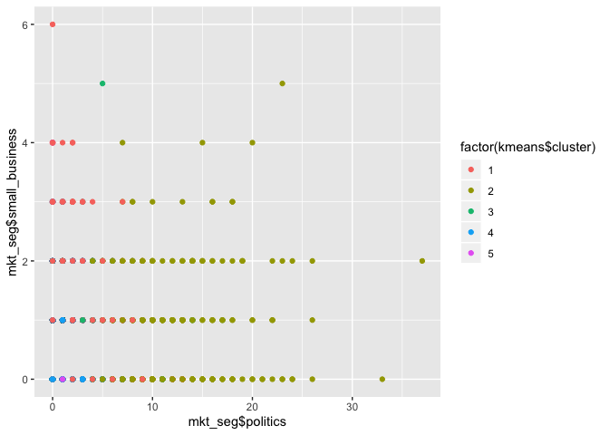

``` r
# cluster 1 
qplot(mkt_seg$beauty,mkt_seg$cooking,color=factor(kmeans$cluster)) 
```

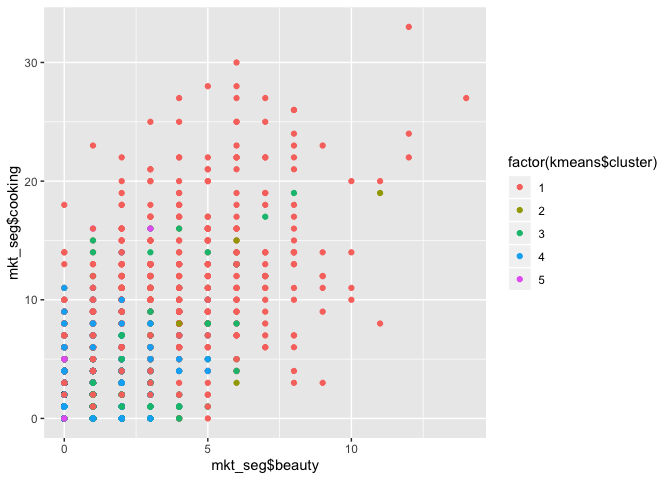

``` r
qplot(mkt_seg$cooking, mkt_seg$fashion,color=factor(kmeans$cluster))
```

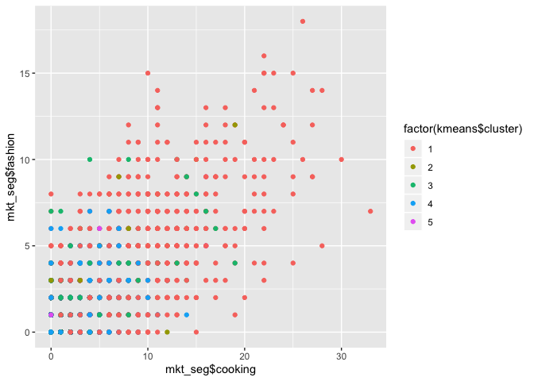

``` r
# cluster 2
qplot(mkt_seg$politics,mkt_seg$travel,color=factor(kmeans$cluster))
```


``` r
qplot(mkt_seg$politics,mkt_seg$news,color=factor(kmeans$cluster))
```

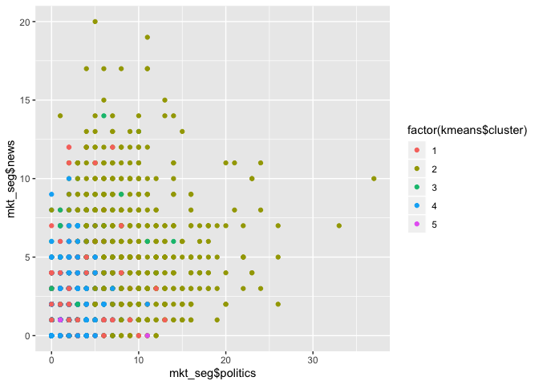

``` r
qplot(mkt_seg$politics,mkt_seg$small_business,color=factor(kmeans$cluster))
```


``` r
# cluster 3
qplot(mkt_seg$religion,mkt_seg$sports_fandom,color=factor(kmeans$cluster)) 
```

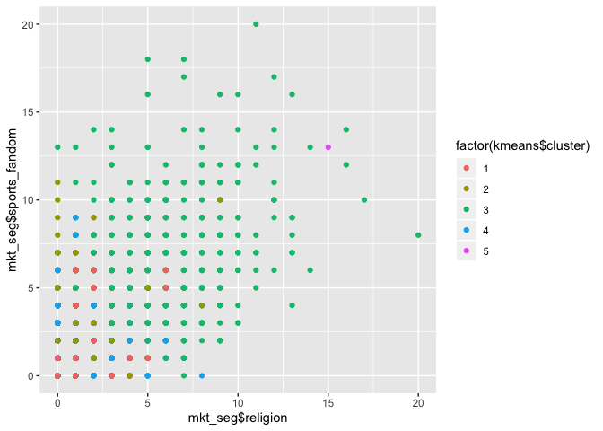

``` r
qplot(mkt_seg$family,mkt_seg$parenting,color=factor(kmeans$cluster))
```

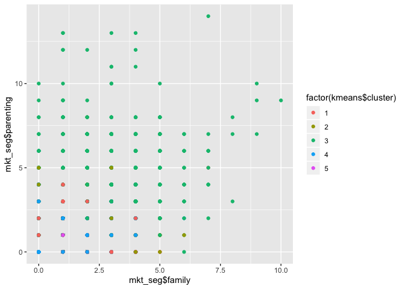

``` r
# cluster 4 
qplot(mkt_seg$politics,mkt_seg$current_events,color=factor(kmeans$cluster))
```


``` r
# cluster 5 
qplot(mkt_seg$adult,mkt_seg$spam,color=factor(kmeans$cluster)) # cluster 5 
```

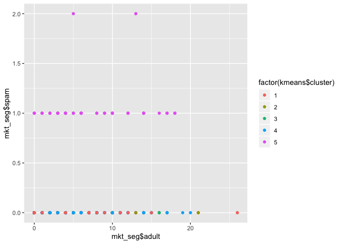 \# Clustering Results

``` r
a=which(kmeans$cluster == 1)
b=which(kmeans$cluster == 2)
c=which(kmeans$cluster == 3)
d=which(kmeans$cluster == 4)
e=which(kmeans$cluster == 5)

library(scales)
```

    ## 
    ## Attaching package: 'scales'

    ## The following object is masked from 'package:purrr':
    ## 
    ##     discard

    ## The following object is masked from 'package:readr':
    ## 
    ##     col_factor

``` r
cluster1 = mkt_seg[a,]
Beauty = sum(cluster1$beauty)/sum(mkt_seg$beauty)
percent(Beauty)
```

    ## [1] "51.5%"

``` r
cluster2 = mkt_seg[b,]
Politics = sum(cluster2$politics)/sum(mkt_seg$politics)
percent(Politics)
```

    ## [1] "45.0%"

``` r
cluster3 = mkt_seg[c,]
Religion = sum(cluster3$religion)/sum(mkt_seg$religion)
percent(Religion)
```

    ## [1] "47.3%"

``` r
cluster4 = mkt_seg[d,]
Current_events = sum(cluster4$current_events)/sum(mkt_seg$current_events)
percent(Current_events)
```

    ## [1] "52.1%"

``` r
cluster5 = mkt_seg[e,]
spam = sum(cluster5$spam)/sum(mkt_seg$spam)
percent(spam)
```

    ## [1] "100%"

``` r
clusters <- c('cluster1', 'cluster2', 'cluster3', 'cluster4','cluster5') 
category <- c('Beauty', 'Politics', 'Religion', 'Current_events','Spam')
Percentage <- c(percent(Beauty),percent(Politics),percent(Religion),percent(Current_events),percent(spam))
data.frame(clusters, category, Percentage)%>% as.tbl
```

    ## # A tibble: 5 x 3
    ##   clusters category       Percentage
    ##   <fct>    <fct>          <fct>     
    ## 1 cluster1 Beauty         51.5%     
    ## 2 cluster2 Politics       45.0%     
    ## 3 cluster3 Religion       47.3%     
    ## 4 cluster4 Current_events 52.1%     
    ## 5 cluster5 Spam           100%

From the visualisation plots, we determine that there are five clusters in the twitter followers for the customer brand: cluster 1: customers who are potentially young ladies who are interested in beauty, cooking, music, art, and fashion cluster 2: customers who are interested politics and people who are fond of traveling cluster 3: customers who are family-oriented and interested in religion cluster 4: customers who are interested in following political news and current events cluster 5: customers who are interested in posting "adult" contents posts are as well as who frequently spam. \# Method 2: PCA analysis

``` r
pc = prcomp(features, scale=TRUE)
#pc # values are eigenvector in each PC 
# summary(pc)
# PC25 explain 91% of the variance 
plot(pc,type="l")
```

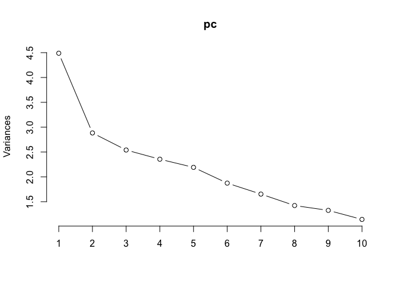

``` r
bp = biplot(pc, scale=0, cex=0.3)
```

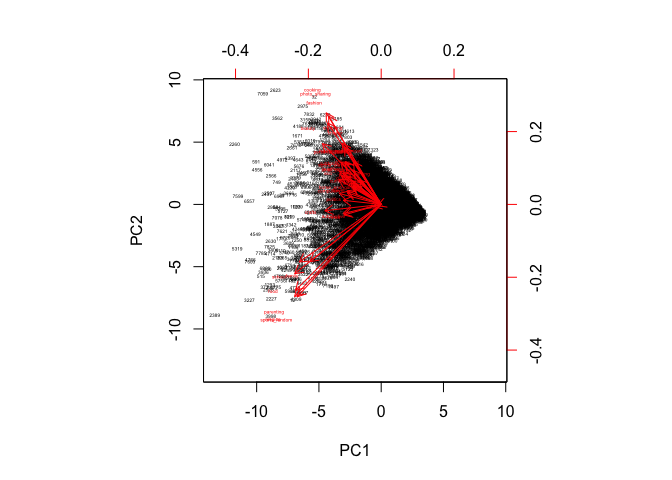

``` r
# Extract PC scores 
#str(pc)
#pc$x
df <- cbind(features, pc$x[, 1:2])
#head(df)

# Plot with ggplot 
library(ggplot2)
df = data.frame(df)
ggplot(df, aes(PC1, PC2)) +  
  geom_point(shape =21, col='black')
```

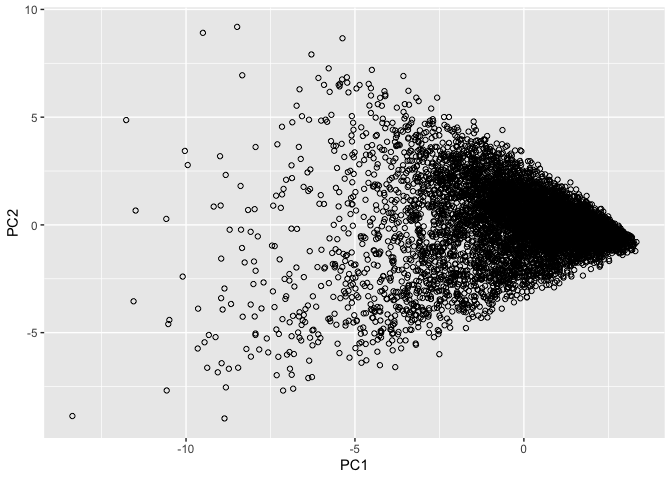

``` r
#pc$x[,1:25]
df = data.frame(pc$x[,1:25])
#df

sort(pc$rotation[,1]) 
```

    ##         religion             food        parenting    sports_fandom 
    ##      -0.29709999      -0.29690952      -0.29400412      -0.28773177 
    ##           school           family           beauty           crafts 
    ##      -0.28063791      -0.24426866      -0.20151836      -0.19362762 
    ##          cooking          fashion    photo_sharing              eco 
    ##      -0.18880850      -0.18388185      -0.18027952      -0.14533561 
    ##        computers         outdoors personal_fitness         business 
    ##      -0.14333124      -0.14260424      -0.13750109      -0.13501004 
    ##         shopping       automotive         politics   sports_playing 
    ##      -0.13299500      -0.13132522      -0.13026617      -0.13021653 
    ##             news          chatter health_nutrition            music 
    ##      -0.12764328      -0.12599239      -0.12420109      -0.12408921 
    ##   small_business           travel  home_and_garden           dating 
    ##      -0.11904181      -0.11664903      -0.11576501      -0.10515646 
    ##              art          tv_film   current_events    uncategorized 
    ##      -0.09794933      -0.09745666      -0.09723669      -0.09443507 
    ##      college_uni    online_gaming            adult             spam 
    ##      -0.09415672      -0.07388979      -0.02673097      -0.01146092

``` r
#religion food parenting sports_fandom (top negative)

sort(pc$rotation[,2]) # sports_fandom religion parenting food (top negative)
```

    ##    sports_fandom         religion        parenting             food 
    ##     -0.316923635     -0.316152778     -0.295082234     -0.237808675 
    ##           school           family             news       automotive 
    ##     -0.197572367     -0.196253208     -0.036198891     -0.031564108 
    ##           crafts            adult             spam         politics 
    ##     -0.021623185     -0.006918154     -0.004551609      0.013939964 
    ##        computers           travel  home_and_garden              art 
    ##      0.037334899      0.039947269      0.046803486      0.060347094 
    ##   current_events           dating          tv_film    online_gaming 
    ##      0.064036499      0.071535239      0.079352508      0.083591578 
    ##              eco   small_business         business   sports_playing 
    ##      0.085321972      0.094048059      0.098782574      0.108595355 
    ##         outdoors      college_uni            music personal_fitness 
    ##      0.113581774      0.115959664      0.144259544      0.144611756 
    ##    uncategorized health_nutrition          chatter           beauty 
    ##      0.146498856      0.146577761      0.197225501      0.208609941 
    ##         shopping          fashion    photo_sharing          cooking 
    ##      0.209852847      0.279799725      0.303077634      0.314287972

``` r
# cooking photo_sharing fashion shopping (top positive)
```

Analyzing the first two principal components of our dataset, we cluster all the followers into three major groups. If we draw an y-axis at x=0, and an x-axis at y=0, we will find inactive twitter users lie on the right of the y-axis. For all the useres on the left of the y-axis, we consider them as active users and cluster them into two major groups. Those users who lie on the second quadrant, we think they are more likely to be middle-aged people who have a family, since they tend to pay more attention about parenting, religion, and family life. While those users who lie on the third quadrant, they tend to be young ladies who focus more on beauty, shopping, fashion and, photosharing.
