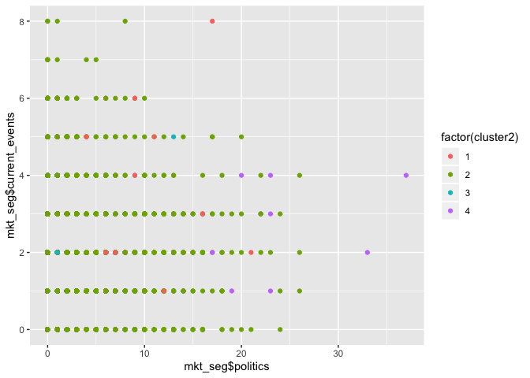

``` r
library(dplyr)
```

    ## 
    ## Attaching package: 'dplyr'

    ## The following objects are masked from 'package:stats':
    ## 
    ##     filter, lag

    ## The following objects are masked from 'package:base':
    ## 
    ##     intersect, setdiff, setequal, union

``` r
mkt_seg = read.csv("/Users/CatherineMiao/Desktop/STA380-master/data/social_marketing.csv") %>% as.tbl
```

We start by applying Hierarchical Clustering method
===================================================

``` r
mkt_seg = read.csv("/Users/CatherineMiao/Desktop/STA380-master/data/social_marketing.csv") %>% as.tbl

raw_features = mkt_seg[-1]
features = scale(raw_features,center = T, scale = T)

feature_distance_matrix = dist(features, method='euclidean')
hier_feature = hclust(feature_distance_matrix, method='complete')
```

``` r
set.seed(3)
plot(hier_feature, cex=0.8)
```


``` r
cluster1 = cutree(hier_feature, k=5)
summary(factor(cluster1))
```

    ##    1    2    3    4    5 
    ##  626 7181   16   49   10

``` r
cluster2 = cutree(hier_feature, k=4)
summary(factor(cluster2))
```

    ##    1    2    3    4 
    ##  642 7181   49   10

We determine that 4 clusters from hierarchical clustering give us the best insights about the followers
=======================================================================================================

``` r
library(ggplot2)
qplot(mkt_seg$family,mkt_seg$parenting,color=factor(cluster2))
```


``` r
# family and parenting, college/ university

# cluster 1 - personal fitness and nutrition 
qplot(mkt_seg$personal_fitness,mkt_seg$health_nutrition,color=factor(cluster2))
```


``` r
qplot(mkt_seg$personal_fitness,mkt_seg$outdoors,color=factor(cluster2))
```


``` r
# cluster 2 - everything else 
qplot(mkt_seg$online_gaming,mkt_seg$college_uni,color=factor(cluster2))
```


``` r
qplot(mkt_seg$art,mkt_seg$music,color=factor(cluster2))
```


``` r
qplot(mkt_seg$uncategorized,mkt_seg$chatter,color=factor(cluster2))
```


``` r
# cluster 3 - spam, adult 
qplot(mkt_seg$spam,mkt_seg$adult,color=factor(cluster2))
```


``` r
qplot(mkt_seg$tv_film,mkt_seg$adult,color=factor(cluster2))
```


``` r
#cluster 4 - news, politics, small business 
qplot(mkt_seg$politics,mkt_seg$news,color=factor(cluster2))
```


``` r
qplot(mkt_seg$politics,mkt_seg$current_events,color=factor(cluster2))
```

 We identified 4 clusters by conducting hierarchical clustering. Most of the users belong to the second clusters, meaning the clusterings have low purity. However, we do disover that users who belong to cluster 1 have a preference for health and nutrition, who belong to cluster 3 make posts on spam and adult-related topics, and who belong to cluster 4 are concerned about politics and current events.

We use K-means++ to improve clustering purity
=============================================

Exploting Correlations between features
=======================================

``` r
#install.packages("corrplot")
library(corrplot)
```

    ## corrplot 0.84 loaded

``` r
#str(mkt_seg)
cormp <- cor(mkt_seg[c(2:37)])

cex.before <- par("cex")
par(cex = 0.7)
corrplot(cormp, method ='shade',tl.cex = 0.65)
```


``` r
#par(cex = cex.before)

# strong corelation between personal fitness and health_nutrition 
# online gaming vs college_uni - 0.77
# travel vs politics - 0.66 
# beauty vs cooking - 0.66 
cor(mkt_seg$politics, mkt_seg$travel) # 0.66 
```

    ## [1] 0.66021

``` r
cor(mkt_seg$online_gaming, mkt_seg$college_uni) # 0.77
```

    ## [1] 0.7728393

``` r
cor(mkt_seg$personal_fitness,mkt_seg$health_nutrition) #0.81
```

    ## [1] 0.8099024

``` r
cor(mkt_seg$religion, mkt_seg$sports_fandom)
```

    ## [1] 0.6379748

``` r
#cormp
#as.data.frame(apply(cormp, 2, function(x) ifelse (abs(x)>=0.6,x,"NA")))
```

``` r
raw_features = mkt_seg[-1]
features = scale(raw_features,center = T, scale = T)

mu = attr(features,"scaled:center")
sigma = attr(features,"scaled:scale")

#nrow(mkt_seg) #7882
#nrow(na.omit(mkt_seg))
set.seed(100)
#install.packages("LICORS")
library(LICORS)

kmeanspp=kmeanspp(features, 5, nstart = 50)
length(which(kmeanspp$cluster == 1)) 
```

    ## [1] 1435

``` r
length(which(kmeanspp$cluster == 2)) 
```

    ## [1] 671

``` r
length(which(kmeanspp$cluster == 3)) 
```

    ## [1] 4163

``` r
length(which(kmeanspp$cluster == 4)) 
```

    ## [1] 741

``` r
length(which(kmeanspp$cluster == 5)) 
```

    ## [1] 872

``` r
library(foreach)
library(dplyr)
library(tidyverse)
```

    ## ── Attaching packages ─────────────────────────────────────── tidyverse 1.2.1 ──

    ## ✔ tibble  2.0.1     ✔ purrr   0.3.0
    ## ✔ tidyr   0.8.2     ✔ stringr 1.3.1
    ## ✔ readr   1.3.1     ✔ forcats 0.3.0

    ## ── Conflicts ────────────────────────────────────────── tidyverse_conflicts() ──
    ## ✖ purrr::accumulate() masks foreach::accumulate()
    ## ✖ dplyr::filter()     masks stats::filter()
    ## ✖ dplyr::lag()        masks stats::lag()
    ## ✖ purrr::when()       masks foreach::when()

``` r
set.seed(2)
mkt_seg = read.csv("/Users/CatherineMiao/Desktop/STA380-master/data/social_marketing.csv") %>% as.tbl
mkt_seg=na.omit(mkt_seg)
raw_features = mkt_seg[-1]
features = scale(raw_features,center = T, scale = T)
k_grid = seq(1,10, by=1)
SSE_grid = foreach(k=k_grid, .combine = "c") %do% {
   cluster_k = kmeanspp(features,k,nstart=50) 
   cluster_k$tot.withinss
 }


plot(k_grid, SSE_grid, xlim=c(0,20))
```


CH Index - measure goodness of fit
==================================

Find the K that maximize CH\_grid
=================================

``` r
N=nrow(mkt_seg)
CH_grid = foreach(k=k_grid, .combine = "c") %do% {
   W = cluster_k$tot.withinss
   B = cluster_k$betweenss
   CH = (B/W)*((N-k)/(k-1))
   CH
 }
plot(k_grid, CH_grid)
```

 From the within cluster sum-of-square plot and the CH index plot, we determine that the optimal number of clusters is between 2 and 15. We would like to use 5 as our number of clusters.

``` r
set.seed(8)

names(mkt_seg)
```

    ##  [1] "X"                "chatter"          "current_events"  
    ##  [4] "travel"           "photo_sharing"    "uncategorized"   
    ##  [7] "tv_film"          "sports_fandom"    "politics"        
    ## [10] "food"             "family"           "home_and_garden" 
    ## [13] "music"            "news"             "online_gaming"   
    ## [16] "shopping"         "health_nutrition" "college_uni"     
    ## [19] "sports_playing"   "cooking"          "eco"             
    ## [22] "computers"        "business"         "outdoors"        
    ## [25] "crafts"           "automotive"       "art"             
    ## [28] "religion"         "beauty"           "parenting"       
    ## [31] "dating"           "school"           "personal_fitness"
    ## [34] "fashion"          "small_business"   "spam"            
    ## [37] "adult"

``` r
qplot(food, cooking, data=mkt_seg, color=factor(kmeanspp$cluster))
```


``` r
qplot(mkt_seg$online_gaming,mkt_seg$college_uni,color=factor(kmeanspp$cluster))
```


``` r
qplot(mkt_seg$art,mkt_seg$music,color=factor(kmeanspp$cluster))
```


``` r
qplot(mkt_seg$small_business,mkt_seg$art,color=factor(kmeanspp$cluster))
```


``` r
qplot(mkt_seg$personal_fitness,mkt_seg$health_nutrition,color=factor(kmeanspp$cluster)) 
```


``` r
qplot(mkt_seg$politics,mkt_seg$travel,color=factor(kmeanspp$cluster))
```


``` r
qplot(mkt_seg$politics,mkt_seg$current_events,color=factor(kmeanspp$cluster))
```


``` r
qplot(mkt_seg$politics,mkt_seg$small_business,color=factor(kmeanspp$cluster))
```


``` r
# cluster 1 
#qplot(mkt_seg$beauty,mkt_seg$cooking,color=factor(kmeanspp$cluster)) 
qplot(mkt_seg$cooking, mkt_seg$fashion,color=factor(kmeanspp$cluster))
```


``` r
# cluster 2
qplot(mkt_seg$politics,mkt_seg$travel,color=factor(kmeanspp$cluster))
```


``` r
qplot(mkt_seg$politics,mkt_seg$news,color=factor(kmeanspp$cluster))
```


``` r
qplot(mkt_seg$politics,mkt_seg$small_business,color=factor(kmeanspp$cluster))
```


``` r
# cluster 3
#qplot(mkt_seg$religion,mkt_seg$sports_fandom,color=factor(kmeanspp$cluster)) 
#qplot(mkt_seg$family,mkt_seg$parenting,color=factor(kmeanspp$cluster))
qplot(mkt_seg$online_gaming,mkt_seg$college_uni,color=factor(kmeanspp$cluster))
```


``` r
# cluster 4 
qplot(mkt_seg$religion,mkt_seg$sports_fandom,color=factor(kmeanspp$cluster)) 
```


``` r
# cluster 5 
qplot(mkt_seg$personal_fitness,mkt_seg$health_nutrition,color=factor(kmeanspp$cluster)) 
```


``` r
names(mkt_seg)
```

    ##  [1] "X"                "chatter"          "current_events"  
    ##  [4] "travel"           "photo_sharing"    "uncategorized"   
    ##  [7] "tv_film"          "sports_fandom"    "politics"        
    ## [10] "food"             "family"           "home_and_garden" 
    ## [13] "music"            "news"             "online_gaming"   
    ## [16] "shopping"         "health_nutrition" "college_uni"     
    ## [19] "sports_playing"   "cooking"          "eco"             
    ## [22] "computers"        "business"         "outdoors"        
    ## [25] "crafts"           "automotive"       "art"             
    ## [28] "religion"         "beauty"           "parenting"       
    ## [31] "dating"           "school"           "personal_fitness"
    ## [34] "fashion"          "small_business"   "spam"            
    ## [37] "adult"

``` r
a=which(kmeanspp$cluster == 1)
b=which(kmeanspp$cluster == 2)
c=which(kmeanspp$cluster == 3)
d=which(kmeanspp$cluster == 4)
e=which(kmeanspp$cluster == 5)

library(scales)
```

    ## 
    ## Attaching package: 'scales'

    ## The following object is masked from 'package:purrr':
    ## 
    ##     discard

    ## The following object is masked from 'package:readr':
    ## 
    ##     col_factor

``` r
# cluster 1 - fashion & beauty 
cluster1 = mkt_seg[a,]
Fashion = sum(cluster1$fashion)/sum(mkt_seg$fashion)
percent(Fashion)
```

    ## [1] "50.5%"

``` r
# cluster 2 - politics 
cluster2 = mkt_seg[b,]
Politics = sum(cluster2$politics)/sum(mkt_seg$politics)
percent(Politics)
```

    ## [1] "43.6%"

``` r
#cluster 3 - adult 
cluster3 = mkt_seg[c,]
Adult = sum(cluster3$adult)/sum(mkt_seg$adult)
percent(Adult)
```

    ## [1] "51.6%"

``` r
# cluster 4 - Religion, Parenting, Family 
cluster4 = mkt_seg[d,]
Religion = sum(cluster4$religion)/sum(mkt_seg$religion)
percent(Religion)
```

    ## [1] "46.4%"

``` r
# cluster 5 - Health, Nutrition 
cluster5 = mkt_seg[e,]
Nutrition = sum(cluster5$health_nutrition)/sum(mkt_seg$health_nutrition)
percent(Nutrition)
```

    ## [1] "52.8%"

We found 5 unique clusterings of the twitter followers

1.  Followers who are interested in Fashion and Beauty
2.  Followers who are interested in Politics and Current Events
3.  Followers who are interested in Adult-Related contents
4.  Followers who are interested in Religion, Parenting, and Family
5.  Followers who are interested in Health and Nutrition

``` r
clusters <- c('cluster1', 'cluster2', 'cluster3', 'cluster4','cluster5') 
category <- c('Beauty', 'Politics', 'Adult', 'Religion','Nutrition')
Percentage <- c(percent(Fashion),percent(Politics),percent(Adult),percent(Religion),percent(Nutrition))
data.frame(clusters, category, Percentage)%>% as.tbl
```

    ## # A tibble: 5 x 3
    ##   clusters category  Percentage
    ##   <fct>    <fct>     <fct>     
    ## 1 cluster1 Beauty    50.5%     
    ## 2 cluster2 Politics  43.6%     
    ## 3 cluster3 Adult     51.6%     
    ## 4 cluster4 Religion  46.4%     
    ## 5 cluster5 Nutrition 52.8%
